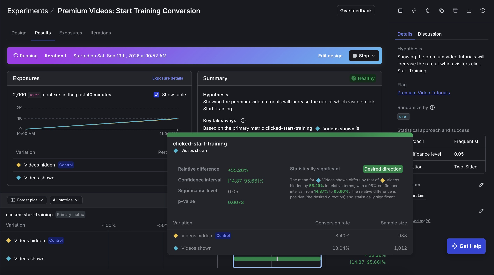
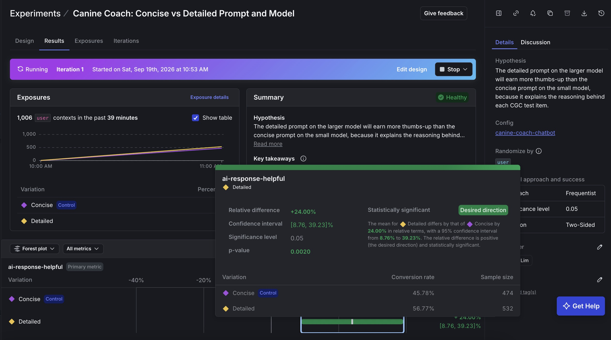

# Sit, Stay, Ship

*A LaunchDarkly demo: release a feature, roll it back, target it, test it, and let an AI Config pick the model.*

The demo is built around **CGC Prep Master**, a fictional company that sells prep courses for the AKC **Canine Good Citizen** (CGC) test. This repository is its landing page, a React app with a small Node backend, built to demonstrate LaunchDarkly end to end. It covers releasing and remediating a feature, targeting, experimentation, AI Configs and integrations.

| Feature area | What this repo demonstrates | Where to read more |
|---|---|---|
| **Release and remediate** | The `premium-video-tutorials` flag releases and rolls back a feature instantly, through a live listener with no page reload. A flag **trigger** turns the feature off remotely (with `curl` or from the browser). | [Release and remediate](#release-and-remediate) |
| **Targeting** | The same flag, targeted by **individual user** (`alex-vip`) and by a **rule** on the context attribute `tier`. | [Targeting](#targeting) |
| **Experimentation** | A metric (`clicked-start-training`) and an experiment on the same flag, with a traffic simulator to generate data. | [Experimentation](#experimentation) |
| **AI Configs** | A real LaunchDarkly **AI Config** drives the chatbot's model and prompt, with an experiment across the variations. Replies come from a free local model. | [AI Configs](#ai-configs) |
| **Integrations** | **Slack** notifications for flag changes, plus optional **New Relic** browser and APM agents. | [Integrations](#integrations) |

Stack: React 19 and Vite, `launchdarkly-react-client-sdk` (browser), `@launchdarkly/node-server-sdk` and `@launchdarkly/server-sdk-ai` (backend), **Terraform** for the LaunchDarkly configuration, Ollama for local models, `@newrelic/browser-agent` and `newrelic` (optional).

**Contents:** [Quick checklist](#quick-checklist-what-to-run-and-what-to-do-by-hand) · [Feature map](#feature-map-what-is-built-and-where-to-see-it) · [Demo storyline](#demo-storyline-a-15-minute-walkthrough) · [How it fits together](#how-it-fits-together) · [Quick start](#quick-start-about-10-minutes) · [Manual setup](#manual-setup-instead-of-the-script) · [Tour of the app](#tour-of-the-app) · [Release and remediate](#release-and-remediate) · [Targeting](#targeting) · [Experimentation](#experimentation) · [AI Configs](#ai-configs) · [Integrations](#integrations) · [Tests](#tests) · [Troubleshooting](#troubleshooting) · [Assumptions and security](#assumptions-and-security-notes) · [Project layout](#project-layout)

---

## Quick checklist: what to run and what to do by hand

**Install once** (about 5 minutes)

| Need | How | Required? |
|---|---|---|
| Node.js 22.12+ and npm | `node -v` | Yes |
| Terraform 1.5+ | macOS: `brew tap hashicorp/tap && brew install hashicorp/tap/terraform` | Yes |
| LaunchDarkly trial account | <https://launchdarkly.com/start-trial/> (includes experimentation, AI Configs, flag triggers) | Yes |
| Ollama (free local models, about 3.3 GB) | `npm run ollama` installs it (macOS, Homebrew) and downloads the models; needs no account or token. Other systems: <https://ollama.com/download> | Optional (canned replies without it) |

**Run** (the commands, in order)

```bash
npm install
npm run ollama                         # optional, no account or token needed: installs Ollama, downloads the models
npm run setup                          # asks for your LaunchDarkly API token the first time (step 1 below)
npm run dev                            # http://localhost:5173
# setup ends by telling you to generate the experiment data (it started both experiments):
npm run simulate -- --target flag --users 5000
npm run simulate -- --target ai --users 2000
```

(`npm run setup -- --install-ollama` does the Ollama part inside setup, if you prefer one command.)

**Do by hand** (the only manual steps)

1. **Create a LaunchDarkly API access token** (2 minutes, before the first `npm run setup`): LaunchDarkly, Account settings, Authorization, Access tokens, Create token, role **Writer**. Paste it when `npm run setup` asks.
2. **Watch the demo happen in two windows:** the app, and the LaunchDarkly dashboard (toggle the flag, add and remove targets, read experiment results). That is the demo itself; the [demo storyline](#demo-storyline-a-15-minute-walkthrough) says what to click.
3. **Read the experiment results** on the Results tab a few minutes after `npm run simulate` (LaunchDarkly analyses in 5-minute steps).
4. **Optional, Slack:** add the Slack integration in LaunchDarkly (about 2 minutes, [steps](#slack-flag-change-notifications)) to see every flag change posted to a channel.
5. **Optional, New Relic:** create the account and apps yourself and add the keys to `.env` ([steps](#new-relic-optional-browser-and-apm-agents)). Nothing else depends on it.
6. **Clean up:** `npm run teardown -- --project <key>` removes everything setup made in a scratch project (see [Try it from scratch](#try-it-from-scratch-like-a-new-user-scratch-project)).

If a setup step reports `[!]`, it says what to finish by hand, and [Manual setup](#manual-setup-instead-of-the-script) covers each one.

---

## Feature map: what is built and where to see it

Each capability, with where to see it.

### Basics: SDKs, instructions and code comments

| Requirement | How it is met |
|---|---|
| Use one of the top 5 LaunchDarkly SDKs | **JavaScript**: `launchdarkly-react-client-sdk` (browser) for Parts 1 and 2 and experimentation, `@launchdarkly/node-server-sdk` and `@launchdarkly/server-sdk-ai` (Node) for the AI Config. |
| Detailed set-up and run instructions, including assumptions about the environment | This README: the [checklist](#quick-checklist-what-to-run-and-what-to-do-by-hand), [Quick start](#quick-start-about-10-minutes), [Manual setup](#manual-setup-instead-of-the-script), [Troubleshooting](#troubleshooting) and [Assumptions and security notes](#assumptions-and-security-notes). |
| Code comments where the SDK key is replaced or a flag is re-created | SDK keys: `.env.example` (every key, where to find it), `src/main.jsx` (client-side ID), `server/index.js` and `server/env.js` (SDK key). Flags: `terraform/main.tf` (each flag, with why it exists; `terraform apply` re-creates them) and `src/components/CGCPrepLanding.jsx` (the flag keys the code reads). |
| A sample app a customer could run | A working landing page with a [tour](#tour-of-the-app), a one-command setup, teardown, tests and a [demo storyline](#demo-storyline-a-15-minute-walkthrough). Demo tooling (user switch, bad-release switch) lives in a clearly separate bar at the top. |

### Release and remediate (you are the engineering manager)

*Scenario: ship faster without more risk. Test in production before releasing to customers, and roll back quickly, with little impact, if a bug slips through.*

| Capability | How it is met | Where to see it |
|---|---|---|
| **Feature flag** around a specific new feature; release by toggling on, roll back by toggling off | Flag `premium-video-tutorials` gates the **Premium Video Tutorials** card (`CGCPrepLanding.jsx` renders `<PremiumVideos />` only when the flag is true). | Toggle the flag's targeting in LaunchDarkly; the card appears and disappears. |
| **Instant releases and rollbacks**: a "listener" so the app switches with no page reload | The SDK streams changes and `useFlags()` re-renders; an explicit `ldClient.on('change:premium-video-tutorials', ...)` listener also raises the "changed live" banner. | Toggle the flag with the app open: the card and banner change within a second, no reload. Covered by tests in `CGCPrepLanding.test.jsx`. |
| **Remediate**: use a trigger to turn off a problematic feature (curl or browser) | A LaunchDarkly **flag trigger** ("turn flag off") created by Terraform. `FlagBoundary` contains the failure and the trigger switches the feature off. | Tick **Simulate a bad release**, then run `curl -X POST "<trigger url>"` or click **Fire kill switch**. |
| *Scenario:* test in production before releasing | The flag starts **dark** (default `false`); a single user is targeted first. | The status strip shows Alex gets the feature ("individual target") while everyone else does not. |
| *Scenario:* roll back with minimal customer impact | Error boundary: only the broken card degrades, the page stays up; the trigger removes it for everyone within a second. | Bad-release switch, then kill switch. |

### Targeting (you are the developer)

*Scenario: a high-traffic landing page revamp; ship well-tested code using individual and rule-based targeting.*

| Capability | How it is met | Where to see it |
|---|---|---|
| **Feature flag** around a specific component (the same flag as above) | The same flag, around the `PremiumVideos` component. | As above. |
| **Context attributes**: create a context with attributes of your choosing and target on them | `user` context with a stable `key`, a `name` and the custom attribute **`tier`** (`free`, `premium`, `beta`, `trial`), built in `src/shared/personas.js`; six personas. | The user dropdown; the status strip prints the persona's key and tier. |
| **Target**: demonstrate both individual and rule-based targeting | **Individual:** `alex-vip` (a free user) gets the feature by key. **Rule:** `tier` is one of `premium`, `beta` (Dana, Maya). Sam matches neither. | Switch personas; the status strip explains each result ("individual target", "targeting rule 1", "default rule"). |
| *Scenario:* well-tested code | Unit tests for the flag behaviour, the listener, targeting context and the error boundary (`npm test`); a single targeted user can test a change first. | `npm test`. |

### Experimentation (you are the product manager)

*Scenario: measure the impact of the new feature to make a data-informed decision.*

| Capability | How it is met | Where to see it |
|---|---|---|
| **Feature flag**: the same flag as the targeting example | `premium-video-tutorials` again. | Experiment page. |
| **Metrics**: create a metric | `clicked-start-training`, a custom conversion metric, sent when a visitor clicks **Start Training** (`ldClient.track`). Created by Terraform. | LaunchDarkly, Metrics. |
| **Experiment**: create an experiment using that flag and metric | `premium-videos-start-training`: the flag's "trial users" rule split 50/50 (`Videos shown` vs `Videos hidden`), metric `clicked-start-training`, created and started by `npm run setup`. | LaunchDarkly, Experiments. |
| **Measure**: run long enough to decide | `npm run simulate` sends thousands of synthetic visitors (clearly marked `synthetic: true`); the Results tab shows conversion per treatment, lift and significance, and you decide to release or not. A [worked example with a screenshot](#reading-the-result-a-real-example) shows how to read it. | Results tab, a few minutes after the simulator finishes. |

### AI Configs (you are the AI product manager)

*Scenario: manage which models and prompts a chatbot uses, to find the most effective configuration.*

| Capability | How it is met | Where to see it |
|---|---|---|
| **AI Config**: change prompts and models quickly | The **Canine Behaviorist AI** chat reads the AI Config `canine-coach-chatbot` (variations `Concise`: small model, short prompt; `Detailed`: larger model, long prompt). Change the served variation, or edit a prompt, in LaunchDarkly and the chat follows within about 3 seconds. Replies come from free local models (Ollama). | The line above the chat names the model; add an individual target on the AI Config to switch a persona. |
| *(Optional)* **Experiment** on prompt and model variants | `canine-coach-prompt-model`: `Concise` vs `Detailed`, metric `ai-response-helpful` (the **Yes** button), created and started by `npm run setup`. | LaunchDarkly, Experiments. |

### Integrations (Slack, Terraform, New Relic)

| Capability | How it is met |
|---|---|
| Explore LaunchDarkly integrations for a more compelling demo | **Slack**: every flag change is posted to a channel (UI in 2 minutes, or `--slack-webhook-url`). **Terraform**: the whole LaunchDarkly setup is code (`terraform/`). Optional **New Relic** browser and APM agents. |

---

## How it fits together

```
Browser (React, port 5173)                     Node backend (port 3001)
  launchdarkly-react-client-sdk                  @launchdarkly/node-server-sdk
    flags, listener, context           /api/*      @launchdarkly/server-sdk-ai (AI Config)
  chatbot UI  ----------------------------->     reply from Ollama (local) / OpenAI / canned
  "Fire kill switch" button  -------------->     POST to the flag trigger URL
        |                                              |
        v                                              v
  LaunchDarkly (flags, targeting, experiments, AI Config, triggers, Slack)
```

- The **browser** uses the client-side SDK with a public client-side ID. It evaluates flags for the persona you pick and re-renders the moment LaunchDarkly pushes a change.
- The **backend** uses the server-side SDK with a secret SDK key. It evaluates the AI Config for the chosen persona, gets a reply from a model, and reports metrics back to LaunchDarkly. It also holds the flag trigger URL, so the URL never reaches the browser.
- **Personas** are six fixed demo users with stable LaunchDarkly context keys, so individual targeting works and results are repeatable:

| Persona | Key | `tier` | Role in the demo |
|---|---|---|---|
| Sam | `sam-free` | free | Not targeted: never sees the feature (the dark default) |
| Alex | `alex-vip` | free | Free tier, but targeted **individually** by key |
| Dana | `dana-premium` | premium | Matched by the tier **rule** |
| Maya | `maya-beta` | beta | Matched by the tier **rule** |
| Jo | `jo-trial` | trial | The **experiment** audience: LaunchDarkly puts each trial user on one side of a 50/50 split |
| Riley | `riley-trial` | trial | Second experiment persona, so two users can show both sides of the split |

---

## Quick start (about 10 minutes)

### 1. Prerequisites

- **Node.js 22.12 or newer** and npm (`node -v`).
- **[Terraform](https://developer.hashicorp.com/terraform/install)** 1.5 or newer (`terraform version`). On macOS: `brew tap hashicorp/tap && brew install hashicorp/tap/terraform`.
- A free **[LaunchDarkly trial account](https://launchdarkly.com/start-trial/)**. The trial includes the features used here (experimentation, AI Configs and flag triggers). A new account has a project called `default` with environments `test` and `production`; this README uses `default` and `test`.
- Optional, for real chatbot replies: **[Ollama](https://ollama.com/download)** (free, runs models on your machine, about 3.3 GB of downloads). `npm run ollama` installs it with Homebrew on macOS and downloads the models (no LaunchDarkly account or token involved); `npm run setup -- --install-ollama` does the same as its last step. Without Ollama the chatbot returns canned replies and everything else still works.
- Optional: a free New Relic account (browser and APM agents) and a Slack workspace (flag notifications).

### 2. Set up everything with one command

```bash
git clone https://github.com/Limalbert96/sit-stay-ship.git && cd sit-stay-ship
npm install
```

You need a LaunchDarkly **API access token**: LaunchDarkly, Account settings, **Authorization**, **Access tokens**, Create token, role **Writer**. It starts with `api-`. This token is only for setup and teardown (Terraform and the API). It is **not** the SDK key and the app never reads it.

```bash
npm run setup -- --dry-run            # optional preview: terraform plan, nothing is changed
npm run setup                         # add --install-ollama to install Ollama too
```

**The first time, `npm run setup` asks you for the token.** Paste it (the input is hidden); it checks the token with LaunchDarkly, and offers to save it in `.env` (git-ignored) so you are not asked again. If you would rather not be asked, set it yourself first: `export LD_API_TOKEN=api-xxxxxxxx`, or put `LD_API_TOKEN=...` in `.env`. `npm run teardown` works the same way. In a non-interactive shell (CI) there is no prompt, so set the variable.

`npm run setup` is safe to run again. It does four things:

1. **Terraform** (`terraform/`) creates everything in LaunchDarkly: the flags `premium-video-tutorials` and `exam-progress-tracker` with descriptions, tags, the individual target `alex-vip`, the tier rule and a dark default (both turned on); the metrics `clicked-start-training` and `ai-response-helpful`; the flag **trigger** that turns the feature off; and the AI Config `canine-coach-chatbot` with two local models and two variations.
2. **`.env`:** writes your environment's client-side ID, SDK key and the trigger URL into `.env` (created from `.env.example` if missing).
3. **LaunchDarkly API:** Terraform has no resource for these, so the script serves the AI Config's two variations 50/50 (otherwise the chatbot would show "switched off") and creates **and starts** the two experiments: the flag on `clicked-start-training` and the AI Config on `ai-response-helpful`. Skip this with `--no-experiments`; `npm run experiments` retries it.
4. **Ollama:** starts it if needed and downloads the two local models (`llama3.2:1b`, `llama3.2:3b`).

Everything it creates is left **on** and ready: both flags are enabled, the chatbot works, and both experiments are running. The flag keeps a dark default, and its experiment runs on its own "trial users" rule (Jo and Riley), so the targeting demo stays predictable.

Options: `--project <key>` and `--env <key>` (defaults `default` and `test`), `--create-project` (make a new project with that key), `--dry-run`, `--install-ollama`, `--skip-models`, `--no-experiments`, `--slack-webhook-url <url>` (also posts every flag change to Slack).

The **project key** is the short ID of your LaunchDarkly project (`default` in a new account), visible in LaunchDarkly URLs such as `.../projects/default/...` and under Project settings. It is not the SDK key.

The script prints a summary. Anything marked `[!]` did not complete (for example a plan without flag triggers) and says what to finish by hand; the [manual setup](#manual-setup-instead-of-the-script) covers each part. What it deliberately does not do:

- **Slack** needs your own workspace: pass `--slack-webhook-url`, or see [Integrations](#integrations).
- **Experiment data.** Setup ends by printing the two `npm run simulate` commands: run them, then read the Results tabs a few minutes later.

> **Why Terraform for this.** The configuration is declarative and readable (`terraform/main.tf` is the whole LaunchDarkly setup in one file), `terraform plan` previews changes, and re-running it fixes drift instead of duplicating things. The provider has no resource for experiments, so those are created through the API by the script. The Terraform and script calls were checked with `terraform validate` and unit tests against a fake LaunchDarkly, not against a live account; the experiment and AI Config default rule calls (LaunchDarkly's AI Configs API is in beta) are the least certain. If a step reports `[!]`, it says what to finish by hand.

### 3. Run the app

```bash
npm run dev      # web app on http://localhost:5173 and chat backend on port 3001
```

Open <http://localhost:5173>.

> **For the chatbot, Ollama must be running.** `npm run dev` takes care of it: if Ollama is installed but stopped it starts `ollama serve` for the session and stops it again when you press Ctrl-C. An Ollama that was already running (the desktop app, or your own `ollama serve`) is left alone. If you run the pieces separately (`npm run dev:web`, `npm run server`), start Ollama yourself: open the Ollama app, or run `ollama serve` in another terminal. Then wait for `Local models ready` in the chat backend's log before the first message. If Ollama is not running the chatbot still answers, but with canned replies, and the line above the chat says so.

By default the backend keeps the models in memory for 30 minutes after the last chat.

### Try it from scratch, like a new user (scratch project)

The quickest way to see exactly what anyone who clones this repo sees is to run setup into a brand-new, empty project:

```bash
npm run setup -- --project cgc-test --create-project     # Terraform creates the project, then everything in it
npm run dev
npm run teardown -- --project cgc-test                   # deletes the whole scratch project when you are done
```

Teardown asks you to type the project key before it deletes anything (a safety check against wiping the wrong project). Add `--yes` to skip the question, or `--dry-run` to only list what it would remove.

(Add `--install-ollama` to the setup line if you also want it to install Ollama; the two flags are independent.)

`--create-project` makes a new project with the key you give (with `test` and `production` environments) instead of using an existing one, and `.env` is pointed at it (your previous `.env` is saved as `.env.bak`). Deleting that project removes every flag, metric, AI Config and experiment in it in one step, **even running experiments**: you do not need to stop anything by hand first. (Teardown forgets the individual resources in Terraform's state and deletes just the project, because LaunchDarkly refuses to delete a flag or metric that an experiment uses.) Creating and deleting a project needs a token with Admin or Owner permissions; the default `Writer` role is enough for the normal setup in an existing project.

### Start over in an existing project (tear down)

```bash
npm run teardown -- --dry-run   # list what would be removed
npm run teardown                # asks you to type the project key first
```

It stops and archives the experiments, runs `terraform destroy` (if Terraform created things), then deletes anything left over through the API, including resources made by hand. LaunchDarkly's own `ld-example-*` samples are never touched.

**A LaunchDarkly limit to know about:** experiments cannot be deleted through the API, only archived, and even archived ones keep blocking the deletion of the flags and metrics they used. So once an experiment has run in a project, its flag and metrics stay there. That is why a scratch project (above) is the reliable way to start over. In a fresh project (which is what a first-time user has) there is nothing to clean up.

### Scripts

| Command | What it does |
|---|---|
| `npm run dev` | Starts the web app and the chat backend together, plus Ollama if it is installed but stopped (stopped again on Ctrl-C) |
| `npm run dev:web` / `npm run server` | Starts them separately |
| `npm run ollama` | Installs Ollama and downloads the two local models; no LaunchDarkly token needed |
| `npm run setup` | One-shot LaunchDarkly setup (above) |
| `npm run experiments` | Creates and starts the two experiments (setup does this; use it to retry) |
| `npm run teardown` | Removes what setup created (above) |
| `npm run simulate -- --target flag\|ai --users N` | Generates synthetic experiment traffic ([details](#the-traffic-simulator)) |
| `npm test` | Runs the unit tests (Vitest) |
| `npm run lint` / `npm run build` | Lint and production build |

---

## Manual setup (instead of the script)

Use this if you prefer clicking, or if a script step reported `[!]`.

### Environment variables (`.env`)

Copy `.env.example` to `.env`. It is git-ignored; never commit it.

| Variable | Where it comes from | Used by |
|---|---|---|
| `LD_API_TOKEN` | LaunchDarkly: Account settings, Authorization, Access tokens (role Writer) | `npm run setup` and `npm run teardown` only |
| `LD_CLIENT_ID` | LaunchDarkly: Project settings, Environments, your environment, **Client-side ID** | Browser SDK |
| `LD_SDK_KEY` | Same page, **SDK key** (secret) | Chat backend, traffic simulator (server SDK) |
| `LD_PROJECT_KEY`, `LD_ENV_KEY` | Written by `npm run setup` (which project and environment you set up) | `npm run experiments`, `npm run teardown` (their default `--project` and `--env`) |
| `LD_TRIGGER_URL` | The flag trigger URL (below). Secret | Chat backend (the kill switch button) |
| `OPENAI_API_KEY`, `OLLAMA_URL` | Optional: OpenAI key (for `gpt-...` models); Ollama address if not the default | Chat backend |
| `NR_ACCOUNT_ID`, `NR_BROWSER_APP_ID`, `NR_BROWSER_LICENSE_KEY` | New Relic: Add data, Browser monitoring, copy/paste snippet | Browser agent (optional) |
| `NR_APM_LICENSE_KEY`, `NR_APM_APP_NAME`, `NR_APM_AIM_ENABLED` | New Relic: Add data, Node.js | Backend APM agent (optional) |

**Why both a client-side ID and an SDK key?** They belong to two different SDKs. The React app uses the *client-side* SDK, which only needs the public client-side ID. The Node backend and the simulator use the *server-side* SDK (which the AI Configs SDK requires), and that needs the secret SDK key. Only the client-side ID and the New Relic browser values ever reach the browser: `vite.config.js` copies just those whitelisted values into the bundle, and refuses to build if `LD_CLIENT_ID` looks like an `sdk-...` key. Use the client-side ID and SDK key of the **same** environment.

You do **not** need the API access token to run the app, only for `npm run setup`, `npm run teardown` and the optional `curl` snippets.

If the client-side ID is missing the app shows a red banner and every flag is off. If the SDK key is missing the chat backend runs on a local fallback config and sends no metrics.

### Create the feature flags

In LaunchDarkly create two **boolean** flags and turn on "SDKs using Client-side ID" for both:

| Flag key | Used for | Code |
|---|---|---|
| `premium-video-tutorials` | Release, targeting and the experiment | `PremiumVideos`, read as `flags.premiumVideoTutorials` |
| `exam-progress-tracker` | Optional gradual-rollout scenario | `ExamTracker`, read as `flags.examProgressTracker` |

**Set the targeting from JSON (fastest).** Open the flag, choose your environment, switch the targeting view to **JSON**, paste this for `premium-video-tutorials`, and click Review and save. Variation `0` is `true`, `1` is `false`.

```json
{
  "offVariation": 1,
  "on": true,
  "prerequisites": [],
  "contextTargets": [{ "variation": 0, "values": ["alex-vip"] }],
  "rules": [
    {
      "description": "Paying and beta tiers",
      "clauses": [{ "contextKind": "user", "attribute": "tier", "op": "in", "values": ["premium", "beta"], "negate": false }],
      "variation": 0
    },
    {
      "description": "Trial users (experiment audience)",
      "clauses": [{ "contextKind": "user", "attribute": "tier", "op": "in", "values": ["trial"], "negate": false }],
      "rollout": { "contextKind": "user", "variations": [{ "variation": 0, "weight": 50000 }, { "variation": 1, "weight": 50000 }] }
    }
  ],
  "fallthrough": { "variation": 1 }
}
```

That gives individual targeting (`alex-vip`), rule-based targeting (`tier` is `premium` or `beta`), a 50/50 rule for `trial` users (the experiment audience) and a dark default (`false` for everyone else). For `exam-progress-tracker` use one rule with `"values": ["beta"]` and no `contextTargets`.

### Create the metrics

LaunchDarkly, Metrics, Create metric, custom **conversion** (occurrence) metrics:

| Metric key | Event key | Sent when |
|---|---|---|
| `clicked-start-training` | `clicked-start-training` | A user clicks **Start Training** |
| `ai-response-helpful` | `ai-response-helpful` | A user clicks **Yes** under a chatbot reply |

### Create the flag trigger

The trigger belongs to one flag *in one environment*. In LaunchDarkly:
1. Open **Premium Video Tutorials** and stay on its **Targeting** tab.
2. Click the three-dot (overflow) menu next to the environment name (for example *Test*) and choose **Configuration in environment**.
3. In the **Triggers** section click **+ Add trigger**. Trigger type **Generic trigger**, action **Turn flag off**, **Save trigger**.
4. **Copy the trigger URL now.** LaunchDarkly shows it only once (you can regenerate it from the trigger's overflow menu). Paste it into `.env` as `LD_TRIGGER_URL`. Anyone holding the URL can turn the flag off, so keep it private.

The "Add adaptive trigger" button you see on individual targeting rules is a different feature.

Command-line alternative (needs `$LD_API_TOKEN`):

```bash
curl -X POST "https://app.launchdarkly.com/api/v2/flags/default/premium-video-tutorials/triggers/test" \
  -H "Authorization: $LD_API_TOKEN" -H "Content-Type: application/json" \
  -d '{"integrationKey": "generic-trigger", "instructions": [{"kind": "turnFlagOff"}]}'
```

Flag triggers are only available on certain plans (the API reference says Enterprise). A free trial includes them. If your account has no **Triggers** section, use the fallback under [Release and remediate](#release-and-remediate).

### Create the AI Config

See [AI Configs](#ai-configs).

### Other `curl` equivalents (optional)

```bash
# create a flag
curl -X POST "https://app.launchdarkly.com/api/v2/flags/default" \
  -H "Authorization: $LD_API_TOKEN" -H "Content-Type: application/json" \
  -d '{"name":"Premium Video Tutorials","key":"premium-video-tutorials","temporary":true,"clientSideAvailability":{"usingEnvironmentId":true}}'

# create the experiment metric
curl -X POST "https://app.launchdarkly.com/api/v2/metrics/default" \
  -H "Authorization: $LD_API_TOKEN" -H "Content-Type: application/json" \
  -d '{"key":"clicked-start-training","name":"clicked-start-training","kind":"custom","eventKey":"clicked-start-training","isNumeric":false,"successCriteria":"HigherThanBaseline"}'
```

---

## Tour of the app

Open <http://localhost:5173>.

| On the page | What it is |
|---|---|
| **Demo controls bar** (top of the page) | Tooling for presenting, kept apart from the site below it: the user switch, the bad-release switch and kill switch, the flag status, and change banners. A real site would not have it. |
| **Simulate user** dropdown | Switches persona. The app re-identifies with a new LaunchDarkly context (same stable key each time) and every flag is re-evaluated for that person. |
| **Simulate a bad release** checkbox | Demo only (release and remediate). Makes the Premium Video card throw, like a buggy deploy. Also available as the URL `/?chaos=1`. |
| **Fire kill switch** button | Appears in the demo bar while *Simulate a bad release* is ticked. Asks the backend to call the flag trigger. |
| **Flag status strip** | Always visible in the demo bar. Shows who you are viewing as, and what each flag serves them and why: *individual target*, *targeting rule 1*, *default rule*, *default rule, in an experiment*, or *flag is off*. |
| **Change banner** | Appears when a flag changes while the page is open: "Flag ... changed to OFF at ... No reload needed." |
| **Start Training** button | The experiment's conversion: clicking it sends the `clicked-start-training` event, the way a real page records someone signing up. |
| **Premium Video Tutorials** card | Behind `premium-video-tutorials`. |
| **Exam Progress Tracker** card | Behind `exam-progress-tracker` (optional scenario). |
| **Canine Behaviorist AI** chat | Driven by the AI Config. The line above it shows the model LaunchDarkly picked and how it runs. Yes and No under a reply are the feedback. |

---

## Release and remediate

The flag is `premium-video-tutorials`; it gates the **Premium Video Tutorials** card.

| Capability | How it is met | How to check it |
|---|---|---|
| Flag around a new feature; release by toggling on, roll back by toggling off | [`CGCPrepLanding.jsx`](src/components/CGCPrepLanding.jsx) renders `<PremiumVideos />` only when `useFlags()` says the flag is true | Turn the flag's targeting on and off in LaunchDarkly and watch the card |
| Instant release and rollback (a listener, no reload) | The SDK streams changes and `useFlags()` re-renders; an explicit `ldClient.on('change:premium-video-tutorials', ...)` listener also shows the banner | Toggle the flag with the app open: the card and banner change within a second and the page never reloads. `npm test` checks the same in `CGCPrepLanding.test.jsx` |
| Remediate with a trigger (curl or browser) | A LaunchDarkly **flag trigger** on this flag | `curl` it, or click **Fire kill switch** in the page (steps below) |

Use a persona who is served `true` (Dana, Maya or Alex) so you can see the card.

### Release and rollback

1. Turn the flag's targeting **off** in LaunchDarkly. In the app the card is gone, because the off variation is `false`.
2. Turn targeting **on**. The card appears and the banner reports the change, with **no page reload**.
3. Turn targeting **off** again. The card disappears instantly. That is the rollback.

### Remediate a bad release with the trigger

**The situation being simulated:** a new feature ships, it is broken, and it has to be switched off immediately, without a deploy.

1. Make sure the flag is on and pick Dana. Tick **Simulate a bad release**. The card now says "temporarily unavailable" while the rest of the page keeps working: the error boundary ([`FlagBoundary.jsx`](src/components/FlagBoundary.jsx)) contained the failure, and reported the error to New Relic if you set it up. **Try again** re-runs the broken code and reports another error.
2. Turn the feature off with the trigger, in either of these ways:
   - **With `curl`** (the trigger URL is a secret webhook; it accepts a POST):
     ```bash
     curl -X POST "<the LD_TRIGGER_URL value from your .env>"
     ```
   - **From the browser:** click **Fire kill switch** (visible while the bad release is ticked). The page asks the backend to call the trigger for you.
3. The flag turns off and the broken card disappears for everyone, live. Nothing was deployed.
4. Restore: turn targeting back on in LaunchDarkly and untick **Simulate a bad release**.

**What "via a browser" means.** A trigger can be fired manually, for example with curl or from a browser. A flag trigger is a webhook URL that accepts a **POST** request, and typing the URL into a browser address bar sends a GET, so it does not work on its own. "Via a browser" therefore means sending that request from a browser-based tool or page. Here the **Fire kill switch** button does it: the browser calls `/api/kill-switch` on the backend, which POSTs to the trigger. (Keeping the trigger URL on the server also keeps the secret out of the page.) A web-based REST client works too.

**If your account has no flag triggers:** turn the flag off through the REST API instead (needs `$LD_API_TOKEN`), which has the same effect:

```bash
curl -X PATCH "https://app.launchdarkly.com/api/v2/flags/default/premium-video-tutorials" \
  -H "Authorization: $LD_API_TOKEN" \
  -H "Content-Type: application/json; domain-model=launchdarkly.semanticpatch" \
  -d '{"environmentKey": "test", "instructions": [{"kind": "turnFlagOff"}]}'
```

---

## Targeting

The context is built in [`src/shared/personas.js`](src/shared/personas.js): a `user` context with a stable key, a name and the custom attribute `tier`. LaunchDarkly evaluates targeting in this order: **individual targets**, then **rules** top to bottom, then the **default rule**.

1. **Dark launch:** with targeting on and the default rule serving `false`, nobody sees the feature. Switch to Sam: no video card. The status strip says "default rule".
2. **Individual targeting:** on the flag, "Target individuals", add `alex-vip` to `true`. Alex is a *free* user, so the rule below cannot reach him; only individual targeting can. Switch to Alex: the card appears and the strip says "individual target". Sam still sees nothing.
3. **Rule-based targeting:** add a rule "Paying and beta tiers": context kind `user`, attribute `tier`, operator "is one of" `premium`, `beta`, serve `true`. Dana and Maya now see the card ("targeting rule 1"). Sam still does not.

Why Sam matters: to prove targeting works you need someone who does *not* match and sees nothing; otherwise "targeted" looks the same as "on for everyone".

---

## Experimentation

Targeting decides *who* gets a feature. An experiment decides *whether it is worth releasing*: it randomly splits people into "shown" and "hidden" and measures what they do.

`npm run setup` creates and starts this experiment (and the AI one); `npm run experiments` retries it. The steps below are what it does, for doing it by hand or understanding it.

**Who is in the experiment.** It runs on its own targeting rule, **"Trial users (experiment audience)"**: `tier` is `trial`, served as a 50/50 rollout. Trial users are the audience the product team wants to test the videos on. Everyone else is unaffected: Sam still gets the dark default, and Alex, Dana and Maya keep their targeting. In the app the experiment personas are **Jo** and **Riley** (both trial). LaunchDarkly hashes each user's key, together with the flag, into one side of the split and keeps the user there, so a persona always gets the same answer: it is sticky, not a coin flip on every page load. Each persona is a coin flip in advance, so Jo and Riley land on opposite sides half of the time. If both see the videos (or both do not), that is normal: the split is 50/50 across many users, not across two. The simulator's 2,000 users show the real balance. The status strip says "targeting rule 3, in an experiment".

**Why the Results tab shows almost no users until you run the simulator.** In the app only Jo and Riley are in the experiment, and only once they load the page after it starts. The simulator supplies the volume: its 2,000 synthetic visitors are all trial users. That is expected, not a fault.

**Hypothesis:** showing the premium video tutorials increases the rate at which trial users click Start Training.

1. **Metric:** `clicked-start-training` (see [Create the metrics](#create-the-metrics)). The **Start Training** button sends it.
2. **Rule:** on the flag, the rule "Trial users (experiment audience)": `tier` is one of `trial`, served as a **percentage rollout, 50% `true` / 50% `false`**, with **Start an experiment** chosen on it. Attach the metric.
3. **Start** the experiment. LaunchDarkly only counts events after the iteration starts.
4. **Generate data** with the [simulator](#the-traffic-simulator):
   ```bash
   npm run simulate -- --target flag --users 5000 --base 0.10 --lift 0.04
   ```
5. **Read the result** on the experiment's Results tab (LaunchDarkly analyses in 5-minute steps, so allow a few minutes), then decide: release the feature to everyone (default rule `true`) or keep it dark.

**What you should see** (a few minutes after the script finishes): two treatments, `Videos shown` and `Videos hidden` (the baseline), each with its number of users, the conversion rate for `clicked-start-training`, and the difference against the baseline with a confidence interval and a significance indicator. With `--users 2000 --base 0.10 --lift 0.04` expect roughly 14% against 10%, and usually a statistically significant lift for `Videos shown`. Numbers vary a little per run because the simulator is random. **Use 5,000 users, not fewer:** with 2,000 users a real 4-point lift shows up as statistically significant only about 4 runs in 5, and the confidence interval is wide. With 5,000 it is significant in nearly every run and the interval is much tighter.

### Reading the result: a real example

This is the Results tab after `npm run simulate -- --target flag --users 2000` (default `--base 0.10 --lift 0.04`), about 40 minutes after the experiment started. The simulated conversion rates are chosen by the script, so **the numbers show how to read the tool, not how real visitors behave.**



| | Videos hidden (baseline) | Videos shown |
|---|---|---|
| Visitors in the experiment | 988 | 1,012 |
| Clicked Start Training | 8.40% (about 83) | 13.04% (about 132) |

What the tooltip says, and what it means for the decision:

- **Relative difference +55.26%.** Showing the videos raised the conversion rate from 8.40% to 13.04%, which is 4.6 percentage points. "Relative" means 13.04 is 55% more than 8.40.
- **p-value 0.0073, significance level 0.05, "Desired direction".** If the videos did nothing, a gap this large would show up by luck less than 1 time in 100. That is below the 5% bar chosen in advance, so LaunchDarkly calls it statistically significant, and it goes in the direction the hypothesis predicted (more clicks).
- **Confidence interval [14.87%, 95.66%].** This is the range the true lift most likely lies in. It is wide, because 2,000 visitors is a small sample for a conversion rate near 10%. The important part is that the **whole range is above 0**, so the videos help. How much they help is uncertain: anywhere from about +15% to nearly +96%. (In this run the simulator's real lift is 10% to 14%, which is +40%. The baseline group happened to land a little low, at 8.40%, so the observed +55% overstates it. The true value is inside the interval, as expected.)
- **Decision.** The result supports releasing the videos to trial users: turn the "Trial users" rule from a 50/50 split into a 100% `true` rollout, then stop the experiment. Expect the real gain to be smaller than +55%, and plan around the low end of the interval.

What this result does **not** tell you, and what a real team would check before going further:

- **Run length.** A real experiment is sized in advance (how many users are needed to detect the smallest lift you care about), run for whole weeks so weekday and weekend behaviour both count, and **not stopped the first time p drops below 0.05** (checking early inflates false positives). The simulator sends 2,000 users at once, so this run shows the workflow, not a run long enough to trust.
- **One metric.** A click on Start Training is not a purchase. A fuller experiment would add a guardrail metric (for example refunds, or errors from the new card) to confirm nothing got worse.
- **Who it covers.** Only trial users were in the experiment, so the result speaks for trial users. Extending it to everyone is a separate decision.

### The traffic simulator

A trial has no real visitors, so [`scripts/simulate-traffic.mjs`](scripts/simulate-traffic.mjs) sends **synthetic** ones. It is **not** one user repeated: `--users 5000` creates 5,000 different users (`sim-flag-user-0` to `sim-flag-user-4999`), all trial-tier, so each is in the experiment. Each one:

1. evaluates the flag (LaunchDarkly buckets them by their key into shown or hidden, which records the experiment exposure), and
2. clicks Start Training with probability `--base` (10% by default), plus `--lift` (4 points) if they were shown the feature.

Every simulated user has `synthetic: true`. **The results demonstrate the workflow, not real customer behaviour.** The lift is a number you choose. You can add real data by opening the app as Jo or Riley (the experiment personas) and clicking Start Training.

Options: `--target flag|ai`, `--users N`, `--base P`, `--lift P`. It uses `LD_SDK_KEY` from `.env`, so it feeds the environment of that key.

---

## AI Configs

The chatbot ([`AIChatbot.jsx`](src/components/AIChatbot.jsx)) calls the backend ([`server/index.js`](server/index.js)), which reads a LaunchDarkly **AI Config** for the current user, gets a reply from a model, and reports duration, tokens, success and thumbs up/down back to LaunchDarkly.

**What an AI Config does and does not do.** It stores the model and prompt and serves them per user, so you can change both in LaunchDarkly without a deploy. It does not call the model. [`server/llm.js`](server/llm.js) does, and it takes the model name at its word, with no mapping:
- a model called `gpt-...` runs on **OpenAI** (needs `OPENAI_API_KEY`),
- any other model (`llama3.2:1b`) runs on **Ollama**, a free tool that runs models on your own machine,
- if that model is not available, you get **canned replies**, so the demo still runs on a bare checkout.

The line above the chat says which of the three is answering.

### Local models with Ollama (about 3.3 GB, works offline)

`npm run setup -- --install-ollama` installs Ollama with Homebrew on macOS, starts it and downloads the models. By hand:

```bash
brew install ollama          # or download from https://ollama.com/download
ollama pull llama3.2:1b      # about 1.3 GB
ollama pull llama3.2:3b      # about 2 GB
```

**Ollama has to be running for the chatbot to use these models.** On macOS the Ollama app starts its server automatically; if you installed only the command line tool (for example with `brew install ollama`), run `ollama serve` in a separate terminal and leave it open. Small local models are slower and less accurate than cloud ones, which is fine for a demo. The backend loads both models when it starts (a cold model can take 10 to 30 seconds), so wait for `Local models ready` in its log before the first message.

### The AI Config

`npm run setup` (Terraform, see `terraform/main.tf`) creates:
- two **model configs**, because LaunchDarkly's model catalog lists cloud models: `Llama 3.2 1B (Ollama)` with model id `llama3.2:1b` and `Llama 3.2 3B (Ollama)` with `llama3.2:3b`;
- the AI Config `canine-coach-chatbot` with two variations:
  - `Concise`: the 1B model, system message "You are a concise Canine Good Citizen coach. Answer in one or two sentences."
  - `Detailed`: the 3B model, system message "You are an expert canine behaviorist specializing in the AKC Canine Good Citizen test. Explain the reasoning behind each test item and give step by step training advice."

The script then serves the two variations 50/50 by default and starts the experiment below.

**By hand:** in LaunchDarkly open **AI Configs** (in the sidebar under **Agents**; AI Configs do not appear in the Flags list). Add the two custom model configs (provider `ollama`, model ids as above), create a **completion** config with key `canine-coach-chatbot`, add the two variations, and on its **Targeting** tab serve one variation (or a 50/50 split). Chat in the app. Switch the served variation in LaunchDarkly: within about 3 seconds the line above the chat shows the new model, and the next reply changes. To change one persona only, add an individual target for it on the AI Config.

**To try OpenAI instead** (needs `OPENAI_API_KEY` in `.env`): create a model config for `gpt-4o-mini`, point a variation at it, and the backend calls OpenAI for that variation. Ollama and OpenAI are never mixed: each model runs where its name says.

### Experiment: which prompt and model works best?

**Why different personas get different models.** The default rule splits `Concise` and `Detailed` 50/50 by a hash of the user's key and the flag, so it is random but sticky: a persona keeps its variation, and it does not depend on tier. A different project hashes differently, so which persona gets which model changes between projects. In the app all six personas are exposed as soon as the chat loads (it polls the AI Config), so the experiment shows about six users before any simulation.

`npm run experiments` does all of this for you (the default rule split is already set by `npm run setup`). By hand:

1. Set the AI Config's default rule to a **50/50 percentage rollout** of `Concise` and `Detailed`. Each person gets one, and keeps it, because the split is by user key.
2. Create an experiment on the AI Config with the custom metric `ai-response-helpful`. Hypothesis: *the detailed prompt on the larger model earns more thumbs-up.* Start it.
3. Generate data with real clicks (chat, then click **Yes** or **No**) or the simulator: `npm run simulate -- --target ai --users 2000 --base 0.50 --lift 0.10`.

How it works: clicking **Yes** records `ai-response-helpful` (the AI Config's built-in feedback metric is recorded as well). LaunchDarkly compares, per variation, the share of exposed users who found a reply helpful. In the Results tab expect two treatments with their helpful rate and a significance indicator; with the command above `Detailed` should come out around 60% against 50%.

**Reading the result: a real example.** After `npm run simulate -- --target ai --users 1000 --base 0.50 --lift 0.10` (synthetic thumbs-up, so again the workflow and not real users):



| | Concise (baseline, `llama3.2:1b`) | Detailed (`llama3.2:3b`) |
|---|---|---|
| Users | 474 | 532 |
| Replies marked helpful | 45.78% | 56.77% |

`Detailed` is +24.00% better in relative terms (about 11 percentage points), p = 0.0020, and the confidence interval [8.76%, 39.23%] sits above 0. So the answer to the hypothesis is yes: the detailed prompt on the larger model earns more thumbs-up, and the decision is to make `Detailed` the default (change the AI Config's default rule to 100% `Detailed`) and stop the experiment. Two things to keep in mind:

- **Prompt and model changed together.** The experiment shows the *bundle* wins. It cannot say whether the prompt or the larger model did the work. To find out, run a follow-up with one change at a time.
- **Thumbs-up is not the whole picture.** A larger model is usually slower and costs more. LaunchDarkly AI Configs can track latency and token use too. A real decision weighs the 24% gain against those, so add them as guardrail metrics before rolling out widely.


### Questions to ask the chatbot

With a real model ask anything about the test: "How do I teach loose leash walking?", "My dog jumps on strangers, what should I do?", "How do I practise sit, down and stay?", "What does the evaluator do in the grooming exercise?". With canned replies the answer keys off these words: stranger, petting, grooming, loose leash, crowd, sit/down/stay, recall, another dog, noise, alone. Anything else returns the list of the 10 test items.

If the AI Config is switched off, the chatbot shows "Assistant is switched off".

---

## Integrations

### Slack: flag change notifications

1. LaunchDarkly: Organization settings (gear icon), Integrations, **Slack**, Add integration.
2. Authorize your Slack workspace and pick a channel. Choose which environments and flags to watch (all is fine for the demo).
3. **Test it:** change any flag in LaunchDarkly (for example toggle `exam-progress-tracker`). A message appears in the channel within seconds, showing who changed what. Firing the flag trigger posts there too, which makes the remediation demo easy to follow.

It needs a Slack workspace you control, so it cannot ship inside this repo.

### New Relic (optional): browser and APM agents

`npm run setup` does not set up New Relic: you create the account and the Browser and APM applications yourself and add their values to `.env` (they are commented out in `.env.example`; with none set, both agents stay off and the app runs normally).

1. **Browser agent (the React app).** In New Relic add a Browser application and copy the IDs into `.env` (`NR_ACCOUNT_ID`, `NR_BROWSER_APP_ID`, `NR_BROWSER_LICENSE_KEY`). [`src/observability.js`](src/observability.js) starts the agent, tags sessions with the user and the current flag value, and reports errors caught by the flag boundary (try **Simulate a bad release**). Confirm it under Browser monitoring; you can query `SELECT * FROM JavaScriptError WHERE appName = 'Canine Good Citizen'`.
2. **APM agent (the Node backend).** Copy the APM license key into `.env` as `NR_APM_LICENSE_KEY` (also `NR_APM_APP_NAME`, `NR_APM_AIM_ENABLED`). `npm run server` preloads the agent through `newrelic.cjs`; without a key it stays disabled. Each chat request carries the persona and the model LaunchDarkly picked as custom attributes.

LaunchDarkly also offers a New Relic integration that writes flag changes to New Relic as deployment markers. It was tried and no events arrived in the current New Relic, which appears to have retired the API it relies on, so it is not used here.

---

## Optional second flag scenario: gradual rollout

The `exam-progress-tracker` flag controls the **Exam Progress Tracker** card and shows a different targeting pattern:

1. Flag `exam-progress-tracker` (created by `npm run setup`) has one rule "Beta testers": `tier` is one of `beta`, serve `true`, and a default rule of `false`. Only Maya sees the tracker.
2. **Gradual rollout:** change the default rule to a percentage rollout, for example 25% `true`, then 50%, then 100%. Non-beta users are bucketed by their context key, so each persona stays in the same group as the percentage grows.

---

## Demo storyline (a 15-minute walkthrough)

One company, four hats. Keep the app and the LaunchDarkly project (`cgc-test`, environment `test`) side by side, plus Slack if you set it up. The **demo bar** at the top of the app shows who you are viewing as and what each flag serves, with the reason.

**Before you start:** `npm run setup` has already created and started both experiments, and (as it told you) you can run the two `npm run simulate` commands now so the results are ready by Act 3. Then `npm run dev`, wait for `Local models ready`, and open <http://localhost:5173>.

### Act 1: Engineering manager, "ship faster, keep quality" (4 minutes)

*The situation: leadership wants features faster, but quality is your brand. You need to test in production safely and undo a bad release fast.*

1. **Release.** Pick **Dana** (premium). Turn `premium-video-tutorials` **on** in LaunchDarkly. The Premium Video card appears and the banner says the flag changed, with no reload. *Say:* "The feature was already deployed, dark. Releasing it is a toggle, not a deploy."
2. **Roll back.** Turn it **off**: the card disappears instantly. *Say:* "That is the listener: the SDK streams the change and the page re-renders."
3. **A bad release.** Turn it on again and tick **Simulate a bad release**. The card degrades to "temporarily unavailable" while the rest of the page keeps working. *Say:* "A bug slipped through. The error boundary limited the damage, but customers still see a broken card."
4. **Remediate with the trigger.** Click **Fire kill switch** (or run `curl -X POST "<trigger url>"`). The flag turns off for everyone within a second. *Say:* "Anything that can POST to a URL can turn the feature off: a monitoring alert, a chatops command, a script. No deploy, no rollback pipeline."
5. Untick the bad-release box and turn the flag back on for Act 2.

### Act 2: Developer, "roll it out carefully" (3 minutes)

*The situation: 40,000 visitors a day depend on this page. You want a specific person, then a specific audience, to see the new component first.*

1. With the flag on and the default `false`, pick **Sam** (free): no card. *Say:* "Nobody gets it yet. This is production-safe."
2. Pick **Alex** (free): the card appears, the strip says **individual target**. *Say:* "Alex is on the flag's individual target list, so a teammate can verify the feature in production before anyone else."
3. Pick **Dana** and **Maya**: they see it, the strip says **targeting rule 1**. *Say:* "This is rule-based: `tier` is `premium` or `beta`. Anyone who matches gets it, with no code change."
4. In LaunchDarkly remove `alex-vip` from the individual targets: Alex's card vanishes live. Add him back.
5. *Point out the context:* a `user` context with a stable key and one attribute, `tier`, defined in `src/shared/personas.js`.

### Act 3: Product manager, "did it help?" (Experimentation, 3 minutes)

*The situation: the team shipped the videos. Do they raise the number of trial users who click Start Training?*

1. Pick **Jo**, then **Riley** (both trial). The strip says "targeting rule 3, in an experiment" for each. Usually one sees the videos and the other does not; sometimes both land on the same side, because each user's side is fixed by a hash of their key. *Say:* "Trial users are the experiment: LaunchDarkly puts each one on a side of a 50/50 split and keeps them there. Sam, Alex, Dana and Maya are unaffected, which keeps the test clean."
2. Open the experiment `premium-videos-start-training` in LaunchDarkly: the hypothesis, the metric `clicked-start-training` and the 50/50 split.
3. Open its **Results** tab (the data came from `npm run simulate -- --target flag --users 2000`: a trial has no real traffic, so it sends 2,000 synthetic trial users marked `synthetic: true`; the lift is a parameter I chose, so the numbers show the workflow, not real behaviour). Point out conversion per treatment, lift and significance (expect about 14% for `Videos shown` against 10% for `Videos hidden`; [a real run](#reading-the-result-a-real-example) is in the README). *Say:* "This is where the PM decides: release to everyone, or don't."

### Act 4: AI product manager, "which prompt and model?" (AI Config, 4 minutes)

*The situation: a support chatbot. You want to change its model and prompt without shipping code, and find the best configuration.*

1. Pick a persona and ask "How do I teach loose leash walking?". The line above the chat names the model (for example `llama3.2:3b`, running locally with Ollama), and the answer follows that variation's prompt.
2. In LaunchDarkly open the AI Config `canine-coach-chatbot`, Targeting, and add an individual target for your persona serving the other variation. Within about 3 seconds the model line changes; ask again and the style changes (short and direct vs step by step). *Say:* "Changing the model or the prompt is a click, not a deploy."
3. Click **Yes** or **No** under replies. *Say:* "Each **Yes** is a metric, `ai-response-helpful`."
4. Run `npm run simulate -- --target ai --users 2000`, and open the experiment `canine-coach-prompt-model` a few minutes later: which variation earns more thumbs-up. Remove your individual target when done.

### Act 5: Integrations (throughout)

If Slack is connected, keep the channel visible during Acts 1 to 4: every toggle, target change and trigger firing is posted there with who did it. *Say:* "That is how the rest of the team sees what changed." Finish with `terraform/main.tf`: "Everything you saw was created from code, in one command."

---

## Tests

```bash
npm test
```

59 tests (Vitest, React Testing Library) covering:
- **Release and remediate behaviour** (`CGCPrepLanding.test.jsx`): the flag gates the feature, the change listener subscribes and unsubscribes, re-identify with a stable persona key, the conversion metric, the bad-release switch with the error boundary, and the kill switch button.
- **Flag explanations** (`FlagStatus.test.jsx`, `flagReason.js`).
- **Model selection** (`server/llm.test.js`): OpenAI, Ollama, canned fallback, the local model mapping and warm-up. **Setup and teardown** (`scripts/setup-lib.test.js`): `.env` merging, Terraform output handling, and every LaunchDarkly API call for experiments and clean-up, against a fake server; the API token checks (`scripts/token.test.js`). The Terraform config is checked with `terraform validate`.
- Personas, environment handling, and the canned replies.

---

## Troubleshooting

| Symptom | Cause and fix |
|---|---|
| Red banner "Set LD_CLIENT_ID in your .env" | `.env` is missing or has no `LD_CLIENT_ID`. Run `npm run setup` or fill it in. |
| Every flag is off | Wrong environment: the client-side ID and the flag targeting must be in the same environment. Also check the flag's targeting is switched **on**. |
| Browser console: `http proxy error ... ECONNREFUSED` | The chat backend is not running. Use `npm run dev` (starts both). |
| Chat says the backend is not reachable | Same as above. |
| Chat replies are "canned" | Ollama is not running or the models are not pulled. Start it (`ollama serve`, or open the Ollama app), run `ollama pull llama3.2:1b` and `ollama pull llama3.2:3b` if you have not, then restart `npm run server`. |
| First chat reply is very slow | A cold model loads into memory. The backend warms both models at startup; wait for `Local models ready`. |
| "Assistant is switched off" | The AI Config's targeting is off, or it serves the `disabled` variation. Turn it on and serve `Concise` or `Detailed`. |
| **Fire kill switch** says "Set LD_TRIGGER_URL" | Put the trigger URL in `.env` (see [Create the flag trigger](#create-the-flag-trigger)) and restart `npm run server`. |
| Flag experiment shows few or 0 users | Expected until you run `npm run simulate -- --target flag --users 5000`: in the app only Jo and Riley are in the experiment. The experiment must be running first (setup starts it), the simulator must use the same environment's `LD_SDK_KEY`, and LaunchDarkly analyses every 5 minutes, so wait a few minutes. |
| Jo or Riley does not see the videos | Trial users are in the 50/50 experiment, and each one is fixed to a side by a hash of their key, so about half of trial users never see the videos. The strip says "in an experiment". That is the experiment working. If Jo and Riley both land on the same side, that is a 1-in-2 chance and not a fault. |
| Some personas get the 3B model and others the 1B | The AI Config's 50/50 split is by a hash of the user key, so it is random but sticky; it is not tied to tier. |
| `terraform apply` fails with "already exists" | Something with the same key was created earlier in that project. Try `npm run teardown`, or (more reliable once experiments have run, see above) set up in a scratch project: `npm run setup -- --project cgc-test --create-project`. |
| `npm run teardown` fails with 409 "still in use in the following experiments" | Only in an existing project, where experiments cannot be deleted through the API. In a scratch project (`--create-project`) teardown deletes the whole project and avoids this. |
| `terraform` not found | Install Terraform (see [Prerequisites](#1-prerequisites)). |
| `--create-project` fails with a permissions error | Creating a project needs a token with Admin or Owner permissions. Use an existing project (the default) with a Writer token, or create the token with a higher role. |
| `npm run setup` says a step needs manual work | The step's message names the LaunchDarkly response. Use the matching manual step above. |
| Build fails with "looks like a server-side SDK key" | `LD_CLIENT_ID` holds an `sdk-...` value. Put the client-side ID there and the SDK key in `LD_SDK_KEY`. |

---

## Assumptions and security notes

- Node.js 22.12 or newer. One LaunchDarkly environment is used for everything (`test` in the examples); the client-side ID and SDK key must come from that same environment.
- All LaunchDarkly configuration (flags, metrics, experiments, AI Config, trigger, Slack) lives in *your* account, so it is created by `npm run setup` or the manual steps rather than committed.
- **Secrets stay out of git:** `.env` is git-ignored. The SDK key, the API token, the trigger URL and the New Relic keys never reach the browser bundle (`vite.config.js` whitelists what is exposed). Rotate any key or trigger URL you have pasted somewhere public.
- **The kill switch endpoint** (`POST /api/kill-switch`) is unauthenticated: anyone who can reach the backend can turn the flag off. That is acceptable for a local demo; a real system would put it behind authentication.
- **Demo-only pieces**, each labelled in code: the **Simulate a bad release** switch, the canned-reply fallback, and the synthetic traffic simulator (simulated results are not real customer behaviour).
- The chat backend keeps AI trackers in memory for 30 minutes so late thumbs up/down feedback can be attributed. A production system would use a shared store.
- Local models are small and can be wrong about dog training. They exist to show the AI Config mechanics, not to give advice.

---

## Project layout

```
.env.example                  every setting, documented
terraform/                    the LaunchDarkly setup as code (flags, targeting, metrics, trigger, AI Config)
docs/images/                  experiment Results screenshots used in this README
newrelic.cjs                  New Relic APM agent config (optional)
vite.config.js                dev server, API proxy, whitelist of browser-visible settings
server/
  index.js                    chat backend: AI Config, metrics, kill switch
  llm.js                      OpenAI / Ollama / canned reply selection, model warm-up
  mockLlm.js                  canned replies
  env.js                      loads .env
scripts/
  setup.mjs, setup-lib.mjs    npm run setup (Terraform, .env, AI Config default rule, experiments, Ollama)
  experiments.mjs             npm run experiments (retries creating and starting both experiments)
  teardown.mjs                npm run teardown
  token.mjs                   asks for and checks the LaunchDarkly API token
  dev.mjs                     npm run dev (app, backend, and Ollama if needed)
  ollama.mjs, ollama-setup.mjs  install, start and feed Ollama (npm run ollama)
  simulate-traffic.mjs        synthetic experiment traffic
src/
  main.jsx                    LaunchDarkly provider (streaming, evaluation reasons)
  observability.js            New Relic browser agent
  shared/personas.js          the six demo users
  flagReason.js, chaos.js     helpers for the status strip and the bad-release switch
  components/
    CGCPrepLanding.jsx        page, listener, persona switch, kill switch
    FlagStatus.jsx            who you are and what each flag serves
    FlagBoundary.jsx          isolates a failing flagged feature
    PremiumVideos.jsx         the flagged feature (release, targeting, experiment)
    ExamTracker.jsx           the optional rollout feature
    AIChatbot.jsx             chat UI
```
